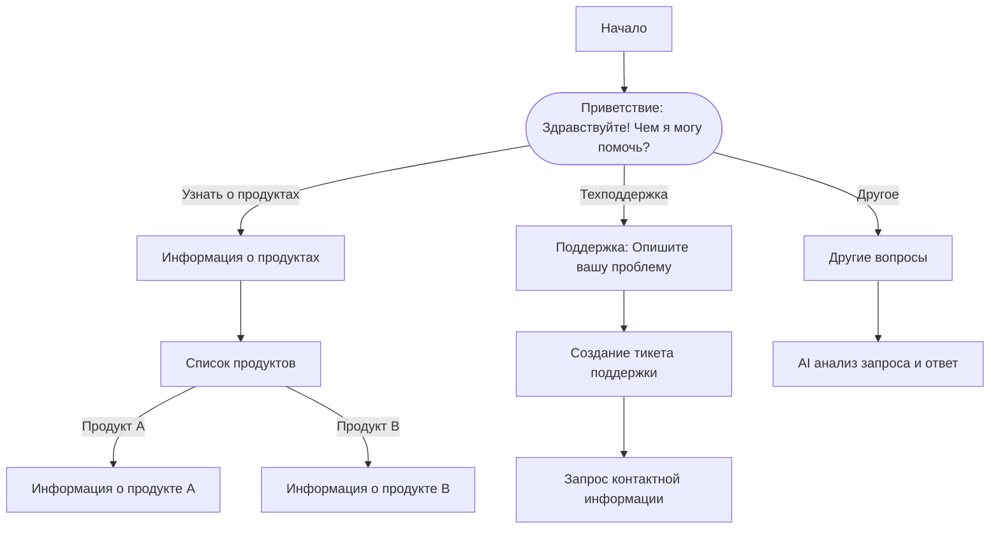

# Braindler AI Chat Script Editor 🚀🎨

---

## Overview

**Braindler AI Chat Script Editor** - инструмент для создания, управления и оптимизации потоков диалогов для AI-ассистентов в экосистеме Braindler.

Редактор позволяет бизнесам и разработчикам **строить интеллектуальные сценарии диалогов** используя простой **текстовый формат Mermaid**, без необходимости писать код. Сценарии напрямую используются **Braindler-Assistant** для автоматизации общения с клиентами на различных платформах.

---

## Ключевые особенности

- **Mermaid-based Flow Editor**  
  Создание диалоговых деревьев с помощью простого и понятного синтаксиса Mermaid.

- **Типы узлов**  
  - Сообщения (текст, изображения, медиа)  
  - Вопросы (с вариантами ответов или свободным вводом)  
  - Действия (интеграции с CRM, отправка email, API вызовы)

- **Визуальное представление**  
  Автоматическая генерация диаграмм на основе текстового описания.

- **Многоязычная поддержка**  
  Определение и редактирование сценариев на разных языках одновременно.

- **Контроль версий**  
  Интеграция с Git для управления версиями сценариев.

- **Готовность к интеграции**  
  Экспорт сценариев в структурированный JSON формат для использования в Braindler-Assistant.

- **Режим предпросмотра**  
  Симуляция взаимодействия с пользователем прямо в редакторе.

---

## Пример построения диалогового потока в Mermaid



## Пример кода для определения простого диалога

```
// Простой сценарий в формате Mermaid
flowchart TD
    start[Начало] --> greeting["Здравствуйте! Чем я могу помочь?"]
    greeting -->|"Каталог"| catalog["Вот наш каталог продуктов"]
    greeting -->|"Цены"| prices["Информация о ценах"]
    greeting -->|"Контакты"| contacts["Наши контакты"]
```

## Преобразование Mermaid в JSON для Braindler-Assistant

```javascript
// Функция преобразует диаграммы Mermaid в рабочий JSON формат для Braindler-Assistant
function convertMermaidToJson(mermaidCode) {
  // Парсинг кода Mermaid
  const nodes = {};
  let startNode = '';
  
  // Код парсинга и преобразования...
  
  return {
    startNode,
    nodes
  };
}
```

---

## Архитектура

| Компонент | Технология |
|:------|:-----------|
| Редактор | Простой текстовый редактор с подсветкой синтаксиса Mermaid |
| Визуализация | Mermaid.js для рендеринга диаграмм |
| Экспорт | Конвертер Mermaid -> JSON для Braindler-Assistant |
| Версионирование | Git / GitHub для сохранения версий |
| Развертывание | Статический сайт (GitHub Pages, Vercel, Netlify) |

---

## Примеры использования

- Разработка **воронок продаж** и **потоков поддержки клиентов**.
- Создание **AI-ассистентов для онбординга** в приложениях и на сайтах.
- Разработка **ботов для опросов** и **сборщиков обратной связи**.
- Быстрое прототипирование новых сценариев диалогов.
- Управление **многоязычными чат-ботами** в разных регионах.

---

## План развития

- 🔄 Двунаправленное редактирование (визуальное и текстовое)
- 🧠 AI-генерация диалоговых потоков на основе описания задачи
- 🎯 Аналитическая панель для оптимизации сценариев
- 📦 Библиотека готовых шаблонов для популярных сценариев

---

## Автор

Разработано [NativeMindNet](https://github.com/NativeMindNet) и [Braindler](https://github.com/braindler)

---

> 🧠 *Braindler AI Chat Script Editor — где ваши диалоги создаются интеллектуально.*
